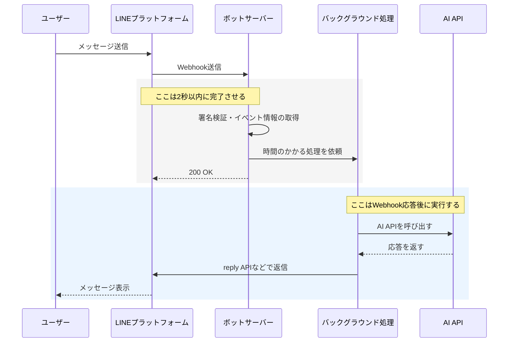

# LINE Messaging API Webhookタイムアウト（2秒制限）に関する補足

LINE Messaging APIのWebhookには、ボットサーバーからLINEプラットフォームへ一定時間内にレスポンスを返す必要がある、という仕様があります。

現在の教材の実装でも、通常の動作確認ではユーザーへの返信が問題なく届くことがあります。  
しかし、AIのAPI呼び出しなど時間のかかる処理をWebhook受信処理の中で同期的に実行すると、LINE Developersコンソール上のWebhookエラー統計にエラーが記録される場合があります。

この資料では、その理由と回避策を補足します。

---

## 1. 2秒タイムアウト仕様（根拠）

LINEプラットフォームは、Webhook送信後にボットサーバーから2秒以内にレスポンスを受信できなかった場合、Webhookエラーとして記録します。

公式ドキュメントでは、Webhookエラーの原因として `request_timeout` が説明されています。

* 公式ドキュメント  
  [LINE Developers: Webhookのエラーの原因と統計情報を確認する](https://developers.line.biz/ja/docs/messaging-api/check-webhook-error-statistics/#check-error-reason)

`request_timeout` は、ボットサーバーがWebhookを受信してから2秒以内にLINEプラットフォームへレスポンスを返さなかった場合に発生します。

---

## 2. ユーザーへの返信とWebhookエラー統計は別の観点

ここで注意したい点は、次の2つは別の観点であることです。

1. LINEプラットフォームへのWebhookレスポンス  
2. ユーザーへのメッセージ返信

たとえば、Webhook受信後にOpenAI APIなどを同期的に呼び出し、その後にLINEのreply APIで返信する実装でも、ユーザーには正常に返信が届くことがあります。

一方で、Webhook受信からLINEプラットフォームへのHTTPレスポンス返却までに2秒を超えると、LINE DevelopersコンソールのWebhookエラー統計には `request_timeout` として記録される可能性があります。

つまり、ユーザー画面では問題なく返信されているように見えても、LINE Developersコンソール上ではWebhookエラーが記録される場合があります。

---

## 3. 同期処理と非同期処理の違い

### 同期処理（現在の教材の標準実装）

Webhook受信処理の中で、そのまま時間のかかる処理を実行する構成です。

たとえば、次のような処理をWebhook受信処理の中で順番に実行します。

1. Webhookを受信する
2. AIのAPIを呼び出す
3. AIの応答を受け取る
4. LINEのreply APIでユーザーへ返信する
5. LINEプラットフォームへHTTPレスポンスを返す

この構成でも、処理全体が短時間で終わればユーザーへの返信は問題なく届きます。  
しかし、AIのAPI呼び出しなどに時間がかかり、LINEプラットフォームへのHTTPレスポンス返却が2秒を超えると、Webhookエラー統計に `request_timeout` が記録される可能性があります。

### 非同期処理（推奨される回避策）

Webhook受信時には、時間のかかる処理をその場で完了させようとせず、まずLINEプラットフォームへ `200 OK` を返します。  
その後、AIのAPI呼び出しやユーザーへの返信はバックグラウンド処理として実行します。

処理の流れは、たとえば次のようになります。

1. Webhookを受信する
2. 必要な情報を取り出す
3. バックグラウンド処理を開始する
4. LINEプラットフォームへすぐに `200 OK` を返す
5. バックグラウンド処理でAIのAPIを呼び出す
6. LINEのreply APIなどでユーザーへ返信する

このようにすることで、2秒超過による `request_timeout` を避けやすくなります。

---

## 4. 実装参考コード

非同期処理を実装した参考コードは、以下を参照してください。

* [chapter5/app_async.py](../chapter5/app_async.py)

現在の教材の実装でも、通常の動作確認では大きな問題に見えない場合があります。  
ただし、LINE Messaging APIの仕様としてはWebhook受信後2秒以内のレスポンスが求められるため、AIのAPI呼び出しなど時間のかかる処理を行う場合は、非同期処理に分ける設計を検討してください。
